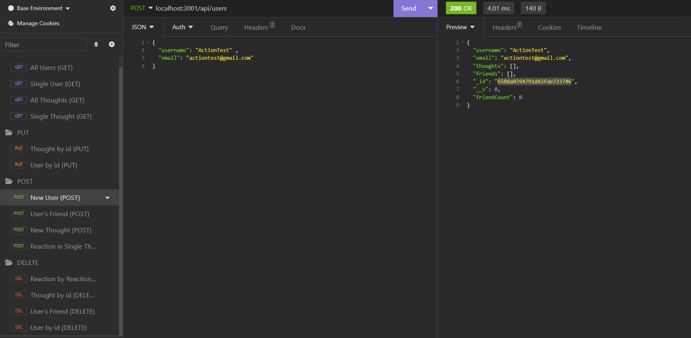

# Social Network API

## My Task

Many of the webs social networks handle amounts of data that tend to lean on the larger size. To have flexibility with data structure is huge across the board. Many of these networks choose to operate with MongoDB because of the speed and structure it provides. Considering the fact that for the remainder of this course we will be be utilizing technologies that social networking platforms also work with, the principles and fundamentals of these applications to come are very important to comprehend. I need to know how to build and structure API's.

My challenge was to build an API for a social network web application. Users are now able to share their thoughts, react to others thoughts, and link with each other through friends lists. I have used Express.js for my routing, MongoDB for my database, and the Mongoose ODM (Object Data Modeling). The following was given to me for guidance during the development stage: [Express.js](https://www.npmjs.com/package/express) and [Mongoose](https://www.npmjs.com/package/mongoose) packages, I have also used JavaScript `Date` object to format timestamps.

**Important**
Because this application wasn't to be deployed I have created a walkthrough video that you can find in the review section of this README. This video will demonstrate the functionality and all of the criteria being met for this challenge.

## User Story

```md
AS A newcomer to the social media industry
I WANT an API for my start company that uses a NoSQL database
SO THAT my social network handles huge amounts of unstructured data like the pros
```

## Acceptance Criteria

```md
GIVEN a social networking API
WHEN I open the application from the command line
THEN my server is started and because of my seeding in the MongoDB database my Models created with Mongoose are in sync
WHEN I open my API GET routes in Insomnia for users and thoughts
THEN open sending the request the data for each of these routes are displayed JSON formatting
WHEN I send requests for my POST, PUT, and DELETE routes in Insomnia
THEN I am able to readily create, update, and delete users and thoughts within my database
WHEN I send requests for my POST and DELETE routes in Insomnia
THEN I am able to swiftly create and delete reactions to thoughts and add and remove friends to or from a user's friends list
```

## Mock Up

The following animations show examples what I was aiming to accomplish on this assignment.

This mock up was provided to me to illustrate all the routes for users and thoughts being tested in Insomnia

The following animation shows GET routes to return all users and all thoughts being tested in Insomnia:


The following animation shows GET routes to return a single user and a single thought being tested in Insomnia:


The following animation shows the POST, PUT, and DELETE routes for users being tested in Insomnia:


The following animation shows the POST and DELETE routes for a user’s friend list being tested in Insomnia:


## Getting Started

I installed on MongoDb and Followed the [MongoDB installation guide on The Full-Stack Blog](https://coding-boot-camp.github.io/full-stack/mongodb/how-to-install-mongodb) to install MongoDB locally.

These are the guidelines I mirrored to set up my models and API routes:

### Models

**User**:

* `username`
  * String
  * Unique
  * Required
  * Trimmed

* `email`
  * String
  * Required
  * Unique
  * Must match a valid email address (look into Mongoose's matching validation)

* `thoughts`
  * Array of `_id` values referencing the `Thought` model

* `friends`
  * Array of `_id` values referencing the `User` model (self-reference)

**Schema Settings**:

I have created a virtual called `friendCount` that retrieves the length of the user's `friends` array field on query.

---

**Thought**:

* `thoughtText`
  * String
  * Required
  * Must be between 1 and 280 characters

* `createdAt`
  * Date
  * Set default value to the current timestamp
  * Use a getter method to format the timestamp on query

* `username` (The user that created this thought)
  * String
  * Required

* `reactions` (These are like replies)
  * Array of nested documents created with the `reactionSchema`

**Schema Settings**:

I have created a virtual called `reactionCount` that retrieves the length of the thought's `reactions` array field on query.

---

**Reaction** (SCHEMA ONLY)

* `reactionId`
  * Use Mongoose's ObjectId data type
  * Default value is set to a new ObjectId

* `reactionBody`
  * String
  * Required
  * 280 character maximum

* `username`
  * String
  * Required

* `createdAt`
  * Date
  * Set default value to the current timestamp
  * Use a getter method to format the timestamp on query

**Schema Settings**:

This is not be a model, but rather is used as the `reaction` field's subdocument schema in the `Thought` model.

### API Routes

**`/api/users`**

* `GET` all users

* `GET` a single user by its `_id` and populated thought and friend data

* `POST` a new user:

```json
// example data
{
  "username": "lernantino",
  "email": "lernantino@gmail.com"
}
```

* `PUT` to update a user by its `_id`

* `DELETE` to remove user by its `_id`

**BONUS**: Remove a user's associated thoughts when deleted.

---

**`/api/users/:userId/friends/:friendId`**

* `POST` to add a new friend to a user's friend list

* `DELETE` to remove a friend from a user's friend list

---

**`/api/thoughts`**

* `GET` to get all thoughts

* `GET` to get a single thought by its `_id`

* `POST` to create a new thought (don't forget to push the created thought's `_id` to the associated user's `thoughts` array field)

```json
// example data
{
  "thoughtText": "Here's a cool thought...",
  "username": "lernantino",
  "userId": "5edff358a0fcb779aa7b118b"
}
```

* `PUT` to update a thought by its `_id`

* `DELETE` to remove a thought by its `_id`

---

**`/api/thoughts/:thoughtId/reactions`**

* `POST` to create a reaction stored in a single thought's `reactions` array field

* `DELETE` to pull and remove a reaction by the reaction's `reactionId` value

## Review 

The following has been placed here to meet requirements for review:

Refer to the following 
[Video Submission](https://drive.google.com/file/d/1oL5UjSHQ_o--UyRpAv_lSq2fRFs5J2pk/view) for a brief demonstration of my application to see its functionality

Refer to this link [GitHub Repository](https://github.com/TheKhalidGibson/SocialNetworkApi) to view and explore the GitHub repo for this assignment


## Screenshots

These screenshots depicted the functionality of this application:




